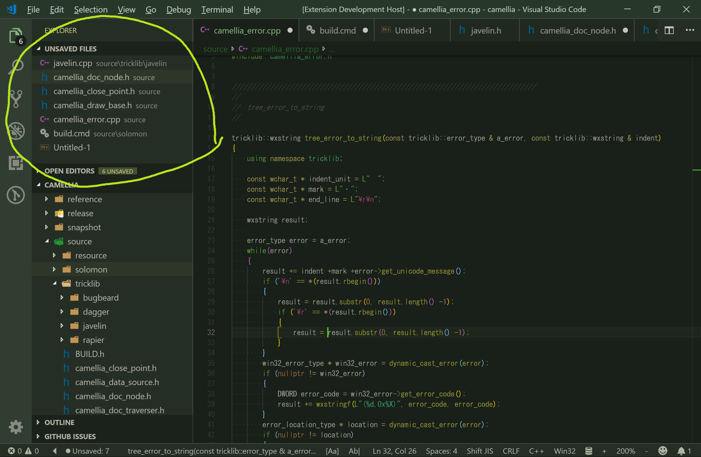
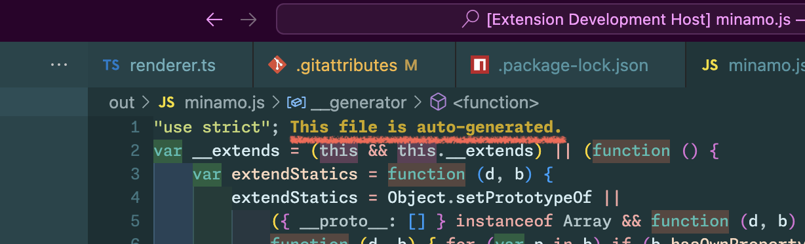

# External Files README

> [!WARNING]
> **This extension is currently under development.**

Easy access to external files for vscode.

## Features

* show external files from command pallete
* show external files from view on explorer

## Tutorial

### 0. ⬇️ Install External Files

Show extension side bar within VS Code(Mac:<kbd>Command</kbd>+<kbd>Shift</kbd>+<kbd>X</kbd>, Windows and Linux: <kbd>Ctrl</kbd>+<kbd>Shift</kbd>+<kbd>X</kbd>), type `external-files-vscode` and press <kbd>Enter</kbd> and click <kbd>Install</kbd>. Restart VS Code when installation is completed.

### 1. ✨️ Show External Files

Click `external:*` in status bar or launch Command Palette(Mac:<kbd>F1</kbd> or <kbd>Shift</kbd>+<kbd>Command</kbd>+<kbd>P</kbd>, Windows and Linux: <kbd>F1</kbd> or <kbd>Shift</kbd>+<kbd>Ctrl</kbd>+<kbd>P</kbd>), Execute `External Files: Show` command and select a external file as you like.

### 2. 🔧 Next step

You can change [settings](#extension-settings) by `settings.json`.

Enjoy!

## Commands

* `External Files: Show` : show external files
* `External Files: Show View` show view on explorer
* `External Files: Hide View` hide view on explorer

## Extension Settings

This extension contributes the following settings by [`settings.json`](https://code.visualstudio.com/docs/customization/userandworkspace#_creating-user-and-workspace-settings)( Mac: <kbd>Command</kbd>+<kbd>,</kbd>, Windows / Linux: <kbd>File</kbd> -> <kbd>Preferences</kbd> -> <kbd>User Settings</kbd> ):

* `external-files.viewOnExplorer.enabled`: set Enable/Disable external files in view on explorer

## Keyboard shortcut Settings

In default, External Files's commands doesn't apply keyboard shortcuts. Althogh,
you can apply keyboard shortcuts by [`keybindings.json`](https://code.visualstudio.com/docs/customization/keybindings#_customizing-shortcuts)
( Mac: <kbd>Code</kbd> -> <kbd>Preferences</kbd> -> <kbd>Keyboard Shortcuts</kbd>, Windows / Linux: <kbd>File</kbd> -> <kbd>Preferences</kbd> -> <kbd>Keyboard Shortcuts</kbd>).

Command name on `keybindings.json` is diffarent from on Command Pallete. See below table.

|on Command Pallete|on keybindings.json|
|-|-|
|`External Files: Show`|`external-files.show`|

## Release Notes

see ChangLog on [marketplace](https://marketplace.visualstudio.com/items/wraith13.external-files-vscode/changelog) or [github](https://github.com/wraith13/external-files-vscode/blob/master/CHANGELOG.md)

## Support

[GitHub Issues](https://github.com/wraith13/external-files-vscode/issues)

## License

[Boost Software License](https://github.com/wraith13/external-files-vscode/blob/master/LICENSE_1_0.txt)

## Download VSIX file ( for VS Code compatible softwares )

[Releases · wraith13/external-files-vscode](https://github.com/wraith13/external-files-vscode/releases)

## Other extensions of wraith13's work

|Icon|Name|Description|
|---|---|---|
| |[Unsaved Files](https://marketplace.visualstudio.com/items?itemName=wraith13.unsaved-files-vscode)|Easy access to unsaved files for VS Code.|
| |[Bracket Lens](https://marketplace.visualstudio.com/items?itemName=wraith13.bracket-lens)|Show bracket header on closing bracket.|
| |[Open in GitHub Desktop](https://marketplace.visualstudio.com/items?itemName=wraith13.zoombar-vscode)|Open in GitHub Desktop from VS Code.|

See all wraith13's expansions: <https://marketplace.visualstudio.com/publishers/wraith13>
