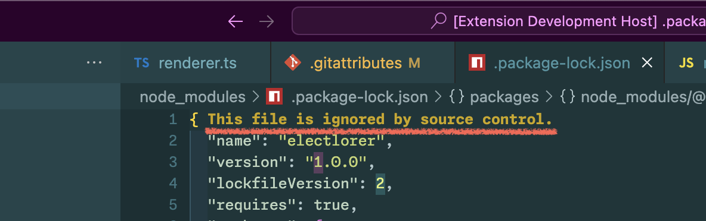

# File Attributes VS Code Extension README

This is a VS Code Extension that refers to `.gitattributes` and `.gitignore`, and displays a message at the top of files that are either auto-generated or not under source control.

Support languages: English(en), Čeština(cs), Deutsch(de), Español(es), Français(fr), Magyar(hu), Italiano(it), 日本語(ja), 한국어(ko), Polski(pl), Português Brasileiro(pt-br), Русский(ru), Türkçe(tr), 简体中文(zh-cn), 繁體中文(zh-tw)

## Screenshots

## Tutorial

### 0. ⬇️ Install File Attributes

Show extension side bar within VS Code(Mac:<kbd>Command</kbd>+<kbd>Shift</kbd>+<kbd>X</kbd>, Windows and Linux: <kbd>Ctrl</kbd>+<kbd>Shift</kbd>+<kbd>X</kbd>), type `file-attributes-vscode` and press <kbd>Enter</kbd> and click <kbd>Install</kbd>. Restart VS Code when installation is completed.

### 1. ✨️ Automatic Warning Display

This extension has no settings or commands. When you open files that are specified as auto-generated in `.gitattributes` or ignored by `.gitignore`, a warning message is automatically displayed at the top of the file.

Enjoy!

## Release Notes

see ChangLog on [marketplace](https://marketplace.visualstudio.com/items/wraith13.file-attributes-vscode/changelog) or [github](https://github.com/wraith13/file-attributes-vscode/blob/master/CHANGELOG.md)

## Support

[GitHub Issues](https://github.com/wraith13/file-attributes-vscode/issues)

## License

[Boost Software License](https://github.com/wraith13/file-attributes-vscode/blob/master/LICENSE_1_0.txt)

## Download VSIX file ( for VS Code compatible softwares )

[Releases · wraith13/file-attributes-vscode](https://github.com/wraith13/file-attributes-vscode/releases)

## Other extensions of wraith13's work

|Icon|Name|Description|
|---|---|---|
| |[Unsaved Files](https://marketplace.visualstudio.com/items?itemName=wraith13.unsaved-files-vscode)|Easy access to unsaved files for VS Code.|
| |[File Path Bar](https://marketplace.visualstudio.com/items?itemName=wraith13.file-path-bar)|Show active file path in status bar.|
| |[Open in GitHub Desktop](https://marketplace.visualstudio.com/items?itemName=wraith13.zoombar-vscode)|Open in GitHub Desktop from VS Code.|

See all wraith13's expansions: <https://marketplace.visualstudio.com/publishers/wraith13>
